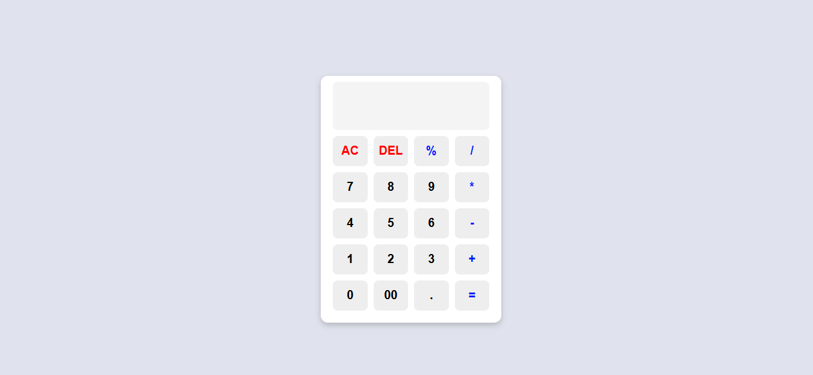

# Calculadora 

Uma calculadora simples e funcional que realiza operações matemáticas básicas. O projeto foi desenvolvido com **HTML**, **CSS** e **JavaScript** para praticar e demonstrar conceitos básicos de desenvolvimento web.

---

## Funcionalidades
- Soma
- Subtração
- Multiplicação
- Divisão
- Porcentagem
- Limpeza total (AC)
- Exclusão de último caractere (DEL)

---

## Estrutura do Projeto

- **HTML**: Estrutura da interface com campos de entrada e botões para interação.
- **CSS**: Estilização para um layout limpo, responsivo e com boa usabilidade.
- **JavaScript**: Lógica de cálculo, controle de entradas e interatividade.

---

## Como Usar
1. Clone o repositório ou copie os arquivos.
2. Certifique-se de que todos os arquivos (HTML, CSS e JS) estão na mesma pasta.
3. Abra o arquivo `index.html` no navegador.
4. Use os botões para realizar cálculos e visualizar os resultados em tempo real.

---

## Estrutura de Pastas
```
Calculadora/
│
├── css/
│   └── style.css
├── js/
│   └── script.js
├── img/
│   └── preview.png
└── index.html
```

---

## Prévia Visual


---

## Tecnologias Utilizadas
- HTML5
- CSS3
- JavaScript ES6

---

## Melhorias Futuras
- Adicionar funcionalidade de histórico de operações.
- Implementar operações avançadas (potência, raiz quadrada).
- Melhorar a estética com temas alternativos.

---

## Autor
Desenvolvido por Luiz Guilherme, com o objetivo de praticar conceitos de desenvolvimento web. Se tiver dúvidas ou sugestões, sinta-se à vontade para contribuir!

